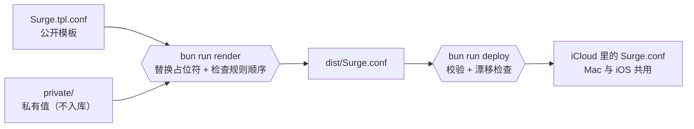
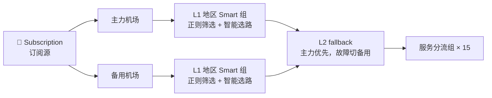

<div align="center">

# Surge Rulekit

[](https://github.com/Yixuling/surge-rulekit/actions)
[](https://nssurge.com)
[](https://bun.sh)
[](https://www.typescriptlang.org)

              

[概览](#概览) • [快速开始](#快速开始) • [模板与私有层](#模板与私有层) • [路由架构](#路由架构) • [规则集](#规则集) • [图标](#图标)

</div>

[Surge](https://nssurge.com) 的个人配置框架。公开仓库里只有一份不含敏感值的配置模板，订阅地址、证书、机场名称等私有值留在本地，渲染时才合成完整配置。仓库同时维护了一套规则集和策略组图标，可以单独通过 raw URL 引用。

## 概览



模板是 Surge 原生语法加占位符，读起来就是一份完整配置；私有层只有几个变量和片段。改配置只改模板或私有层，渲染与部署由脚本完成。

## 特性

- **模板与私有值分离**：公开模板可以直接给别人参考，敏感值永远不进仓库
- **规则顺序检查**：`[Rule]` 段的先后依赖写成约束表，顺序被打乱时渲染直接报错
- **部署防覆盖**：部署前先校验语法，再比较 iCloud 里的配置有没有在 UI 或 iOS 上被改过，改过就停下并列出语义差异
- **提交前防泄露**：pre-commit 与 commit-msg 两个 hook 用私有层的值扫描暂存内容和提交信息，命中即拒绝
- **自维护规则集**：补社区规则没覆盖或更新滞后的域名，Apple Intelligence 那份与官方文档逐条对应
- **可复现的图标**：15 个策略组图标由脚本生成，上游素材固定版本并校验 sha256，重建逐字节一致

## 快速开始

需要：

- [Surge for Mac](https://nssurge.com)（部署与语法校验用到其自带的 `surge-cli`）
- [Bun](https://bun.sh)
- 可选：`imagemagick` 与 `librsvg`（重建图标）、[1Password CLI](https://developer.1password.com/docs/cli/)（备份私有层）

```bash
git clone https://github.com/Yixuling/surge-rulekit.git
cd surge-rulekit
cp -R private.example private   # 填入 values.env、snippets/ 与 deny.txt
bun run render                  # 生成 dist/Surge.conf
bun run hooks                   # 启用提交前扫描
```

确认 `dist/Surge.conf` 无误后再部署：

```bash
bun run deploy
```

> [!WARNING]
> `deploy` 会覆盖 iCloud 里正在使用的 `Surge.conf` 并让 Surge 重新加载，Mac 与 iOS 同时生效。不用 iCloud 时，用 `SURGE_PROFILE=<路径> bun run deploy` 指定配置文件。

### 命令

| 命令 | 作用 |
|---|---|
| `bun run render [目录]` | 用私有层（默认 `private/`）渲染模板到 `dist/Surge.conf`，并检查规则顺序 |
| `bun run deploy [--force]` | 渲染 → `surge-cli` 校验 → 漂移检查 → 写入 iCloud → 重载 |
| `bun test` | 单元测试（含用 `private.example/` 完整渲染一遍模板） |
| `bun run icons [名称...]` | 重建全部或指定图标，并输出明暗双主题预览图 |
| `bun run hooks` | 启用 `scripts/hooks/` 里的提交扫描 |
| `bun run private:backup` / `private:restore` | 把 `private/` 打包存入 / 取回 1Password |

## 模板与私有层

模板里有两种占位符：

- `{{变量名}}`：替换为 `private/values.env` 中的同名变量
- `{{> 片段名}}`：独占一行，内联 `private/snippets/片段名.conf` 的多行内容

模板开头第一段注释只描述模板本身，渲染时会换成「由模板生成，勿直接编辑」的说明。

| 私有层文件 | 内容 |
|---|---|
| `values.env` | 模板变量，`KEY=value`。`SECRET_` 开头的值会进入提交扫描清单 |
| `snippets/*.conf` | 多行私有片段，如本地直连规则；其中出现的域名会进入扫描清单 |
| `deny.txt` | 扫描清单的补充：被截断、换写法或本身太短的敏感片段，每行一条 |
| `state/` | `deploy` 记录的上次部署内容，用于漂移检查 |

> [!IMPORTANT]
> 未定义的变量、缺失的片段、没用到的变量或片段、写错格式的占位符，都会让 `render` 直接失败，不会产出半成品配置。新增变量时记得同步在 `private.example/` 里加示例值，否则 CI 会失败。

没有私有值可扫描的 fork，用 `git config surge-rulekit.allow-no-private true` 放行提交扫描。

## 路由架构



每家机场的每个地区（香港、新加坡、美国、日本、台湾）各有一个 Smart 组，直接按节点名正则筛选并智能选路；同地区两家机场再由 fallback 做主备切换。两家机场没有混进同一个 Smart 组：实测两家的延迟档位差得多，混编后选路反而不稳。

15 个服务分流组（Apple、AI、Google、Netflix 等）各自独立选择出口：代理、直连、专线、任一地区或具体节点。

> [!NOTE]
> `[Rule]` 段有顺序依赖，比如 Apple 需代理的规则须在 `17.0.0.0/8` 直连之前、AI 须在 Google 之前、微信须是第一个规则集。约束与原因都写在 [`src/order.ts`](src/order.ts)，调整规则顺序前先看那里。

## 规则集

| 规则集 | 用途 |
|---|---|
| [`AI.list`](rules/AI.list) | OpenAI / Anthropic / Gemini 等 AI 服务（含登录验证域名） |
| [`AppleIntelligence.list`](rules/AppleIntelligence.list) | Apple Intelligence 所需代理域名，与 Apple 官方 [101555](https://support.apple.com/101555) 文档逐条对应 |
| [`AppleExtra.list`](rules/AppleExtra.list) | 社区 Apple 规则未覆盖的账户 API 与媒体边缘域 |
| [`AppleDirect.list`](rules/AppleDirect.list) | App Store 购买 API 与安装包 CDN（直连） |
| [`ArcDia.list`](rules/ArcDia.list) | Arc / Dia 浏览器 |
| [`DeepL.list`](rules/DeepL.list) | DeepL 翻译 |

在自己的配置里引用：

```ini
RULE-SET, https://raw.githubusercontent.com/Yixuling/surge-rulekit/refs/heads/main/rules/AI.list, AI, extended-matching
```

> [!TIP]
> 规则集更新推送后，Surge 不会立刻拉取新版本。执行 `surge-cli external-resource update all` 手动刷新。

## 图标

144×144 透明底 PNG，logo 铺满无底盘。黑色系官方标（Apple、GitHub、X 等）逐个做了双主题处理，深浅色界面下都看得清。

```bash
bun run icons              # 全部重建 + 明暗预览
bun run icons Netflix AI   # 只重建指定图标
```

上游素材（simple-icons、dashboard-icons 等）固定到版本或 commit，下载后按 [`scripts/icons.lock`](scripts/icons.lock) 校验 sha256；上游内容变化时脚本直接失败，不会静默产出不同的图。升级来源后用 `UPDATE_LOCK=1 bun run icons <名称>` 重新记录。新增图标的步骤见脚本头部注释。

## 项目结构

```
Surge.tpl.conf        配置模板
private.example/      私有层示例（复制为 private/ 后填值）
rules/                自维护规则集
icons/                策略组图标（由脚本生成）
src/                  渲染、顺序约束、规范化与私有层读取
src/cli/              render、deploy、scan 命令入口
src/tests/            单元测试
scripts/              图标生成脚本与 git hooks
```

维护约定与架构决策见 [AGENTS.md](AGENTS.md)。
