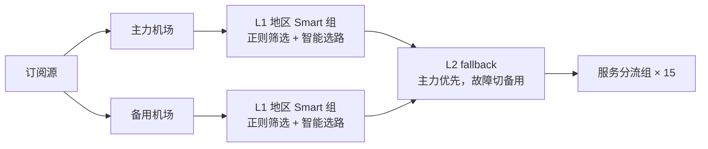

<div align="center">

# Surge Rulekit

[Surge](https://nssurge.com)（macOS/iOS 代理工具）的个人配置：两层路由、自维护规则集与策略组图标，配置由公开模板和本地私有层渲染而成。

</div>

<p align="center">
                
</p>

## 用法

需要 [bun](https://bun.sh)。

```bash
cp -R private.example private   # 填入 values.env、snippets/ 与 deny.txt
bun run render                  # 输出 dist/Surge.conf，并检查规则顺序
bun run deploy                  # 校验 → 写入 iCloud 里的 Surge.conf → 重载（会改动正在运行的配置）
bun run hooks                   # 启用提交扫描
```

`Surge.tpl.conf` 是 Surge 原生语法加两种占位符：`{{变量名}}` 取自 `private/values.env`，独占一行的 `{{> 片段名}}` 内联 `private/snippets/片段名.conf`；模板开头第一段注释只描述模板，渲染时换成生成说明。不用 iCloud 时，用 `SURGE_PROFILE=<路径>` 指定部署位置。

- **规则顺序**：`[Rule]` 段有顺序依赖，比如 Apple 规则须在 `17.0.0.0/8` 之前、AI 须在 Google 之前。约束写在 [`src/order.ts`](src/order.ts)，渲染时违反就报错。
- **防泄露**：`SECRET_*` 的值、`private/deny.txt` 里的片段，以及片段文件里出现的域名，会在 `pre-commit` 和 `commit-msg` 阶段被扫描，命中就拒绝提交。没有私有层的 fork 可以用 `git config surge-rulekit.allow-no-private true` 放行。
- **防覆盖**：`deploy` 会比较 iCloud 里的配置和上次部署的版本（忽略 UI 保存造成的格式差异）。如果在 UI 或 iOS 上改过，它会列出差异并停下，不会直接覆盖。

## 两层路由



同地区的两家机场没有混进同一个 Smart 组：两家的延迟档位差得多，混在一起选路反而不稳，所以主备切换交给 fallback。

## 规则集

| 规则集 | 用途 |
|---|---|
| [`AI.list`](rules/AI.list) | OpenAI / Anthropic / Gemini 等 AI 服务（含登录验证域名） |
| [`AppleIntelligence.list`](rules/AppleIntelligence.list) | Apple Intelligence 代理域名，与官方 [101555](https://support.apple.com/101555) 文档逐条对应 |
| [`AppleExtra.list`](rules/AppleExtra.list) | 社区 Apple 规则未覆盖的账户 API 与媒体边缘域 |
| [`AppleDirect.list`](rules/AppleDirect.list) | App Store 购买 API 与安装包 CDN（直连） |
| [`ArcDia.list`](rules/ArcDia.list) | Arc / Dia 浏览器 |
| [`DeepL.list`](rules/DeepL.list) | DeepL 翻译 |

```
RULE-SET, https://raw.githubusercontent.com/Yixuling/surge-rulekit/refs/heads/main/rules/AI.list, AI, extended-matching
```

## 图标

144×144 透明底 PNG，明暗主题下都看得清。图标由 `bun run icons [名称...]` 生成，需要 imagemagick 和 librsvg。新增图标的方法见脚本头部注释。

维护约定见 [CLAUDE.md](CLAUDE.md)。
